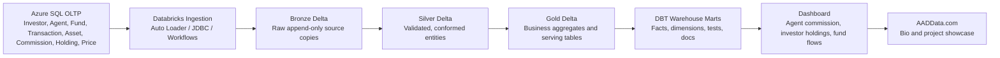

# Mutual Fund Data Engineering Platform

Portfolio project for a senior data engineer preparing for Databricks Data Engineer Associate and Snowflake SnowPro Core certifications.

The project models a mutual fund transfer agency platform with investor transactions, agent commissions, fund prices, holdings, and warehouse analytics. It is designed to show enterprise data engineering skills across Azure SQL, Databricks Delta Lake, DBT, analytics marts, and a web dashboard.

## Why This Project

This project is intentionally aligned to real transfer agency and asset servicing work:

- Investor, agent, fund, transaction, holding, price, asset, and commission domains.
- EOD and intraday reporting patterns.
- Retrocession and commission-style calculations.
- Data lake hydration from a relational source.
- Data quality, lineage, reconciliation, and auditability.
- Warehouse facts and dimensions for BI consumption.

## Target Architecture

## Repository Map

- `docs/` - project brief, architecture, data model, implementation roadmap.
- `sql/` - Azure SQL transactional schema and seed data plan.
- `databricks/` - notebook and job design notes for Delta Lake ingestion and processing.
- `docs/pipeline_and_azure_setup.md` - recommended pipeline and Azure services setup.
- `dbt/mutual_fund_dbt/` - starter DBT project for facts, dimensions, tests, and documentation.
- `dashboard/` - web dashboard specification and starter Streamlit app.
- `website/` - AADData.com bio site starter page and portfolio copy.

## Learning Outcomes

By completing this project you will practice:

- Azure SQL relational modelling and source-system constraints.
- Incremental ingestion into Delta Lake.
- Delta Lake features including schema enforcement, merge, time travel, change data feed, optimize, vacuum, constraints, and medallion architecture.
- Databricks workflows, notebooks, SQL warehouses, Unity Catalog-oriented naming, and data quality checks.
- DBT modelling, sources, staging, marts, generic tests, custom tests, snapshots, and documentation.
- Dimensional modelling with daily and monthly fact tables.
- Dashboard-ready serving tables and KPI definitions.
- Portfolio storytelling through AADData.com.

## Suggested Build Order

1. Create Azure SQL schema and generate realistic sample data.
2. Load generated source CSV files into Azure SQL.
3. Ingest Azure SQL source tables into Bronze Delta.
4. Build Silver Delta tables with data quality checks and deduplication.
5. Build Gold business tables for holdings, commissions, fund flows, and AUM.
6. Use DBT to publish warehouse facts and dimensions.
7. Build dashboard pages over the curated marts.
8. Publish AADData.com as a bio plus project showcase website.

## Core Dashboards

- Agent commission by day, month, fund, and commission type.
- Investor holdings by fund, asset class, and valuation date.
- Investment and redemption flows by fund per day and month.
- Fund AUM, NAV movement, and transaction volume.
- Data quality and reconciliation status for portfolio credibility.
