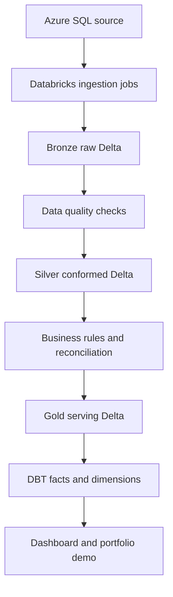

# Architecture

## High-Level Design

The platform follows an enterprise lakehouse pattern:

1. Azure SQL stores normalized operational data.
2. Databricks ingests source tables into Bronze Delta.
3. Silver Delta standardizes, validates, and conforms source entities.
4. Gold Delta creates business-level aggregates.
5. DBT builds governed facts and dimensions.
6. Dashboard reads from Gold/DBT marts.
7. AADData.com links to the dashboard and explains the project.

## Naming Convention

Use a catalog and schema pattern that is easy to translate between Databricks and Snowflake:

- Catalog/database: `aaddata_mf`
- Bronze schema: `bronze`
- Silver schema: `silver`
- Gold schema: `gold`
- DBT marts schema: `mart`

Example:

```sql
aaddata_mf.silver.investor
aaddata_mf.gold.fact_agent_commission_daily
aaddata_mf.mart.dim_fund
```

## Data Flow



## Bronze Layer

Purpose:

- Preserve source records with minimal transformation.
- Add ingestion metadata.
- Support replay and audit.

Recommended columns:

- `_ingested_at`
- `_source_system`
- `_source_table`
- `_batch_id`
- `_record_hash`
- `_is_deleted`

Delta features to demonstrate:

- Schema enforcement.
- Schema evolution in controlled ingestion.
- Append-only history.
- Time travel for point-in-time investigation.

## Silver Layer

Purpose:

- Clean and standardize entities.
- Apply deduplication.
- Enforce business keys.
- Normalize date, amount, currency, and status values.

Recommended checks:

- Investor, agent, fund, and transaction IDs are not null.
- Transaction amount is positive for subscription and negative for redemption, or explicitly signed by transaction type.
- Fund price must be greater than zero.
- Holding units cannot be negative except for rejected test records.
- Commission rate must be within configured boundaries.

Delta features to demonstrate:

- `MERGE INTO` for incremental upserts.
- Generated columns for month keys or date keys.
- Constraints for critical quality rules.
- Change Data Feed for downstream incremental consumption.

## Gold Layer

Purpose:

- Business-ready tables and aggregates.
- Dashboard-friendly daily and monthly metrics.
- Reconciled outputs for portfolio credibility.

Gold examples:

- `gold.agent_commission_daily`
- `gold.agent_commission_monthly`
- `gold.investor_holding_daily`
- `gold.fund_flow_daily`
- `gold.fund_flow_monthly`
- `gold.fund_aum_daily`
- `gold.data_quality_run_summary`

Delta features to demonstrate:

- Optimize selected high-read tables.
- Vacuum with documented retention policy.
- Time travel comparison between two calculation versions.
- Change Data Feed feeding DBT incremental models.

## DBT Role

Use DBT for analytics engineering, not raw ingestion.

DBT should:

- Declare sources over Silver/Gold tables.
- Build dimensional models and facts.
- Add generic tests and custom business tests.
- Generate documentation and lineage.
- Manage incremental marts where suitable.

Recommended DBT layers:

- `models/staging` - lightly renamed and typed source models.
- `models/intermediate` - reusable business logic.
- `models/marts` - final dimensions and facts.

## Warehouse Facts And Dimensions

Dimensions:

- `dim_investor`
- `dim_agent`
- `dim_fund`
- `dim_asset`
- `dim_date`

Facts:

- `fact_transaction`
- `fact_agent_commission_daily`
- `fact_investor_holding_daily`
- `fact_fund_flow_daily`
- `fact_fund_flow_monthly`
- `fact_fund_aum_daily`

## Dashboard Architecture

Recommended first version:

- Streamlit app reading DBT mart tables.
- Local mode can read CSV extracts.
- Cloud mode can use Databricks SQL Warehouse or Snowflake connection.

Dashboard pages:

- Overview.
- Agent commission.
- Investor holdings.
- Fund flows.
- Reconciliation and data quality.

## Certification Mapping

Databricks Associate practice:

- Lakehouse medallion architecture.
- Delta table creation and maintenance.
- Incremental pipelines.
- Workflows.
- SQL analytics.
- Data quality and constraints.

SnowPro Core practice:

- Dimensional modelling.
- Warehouse concepts.
- Role and schema organization.
- Secure views and masking concepts.
- Performance and clustering concepts.
- Time travel and data retention comparison.

