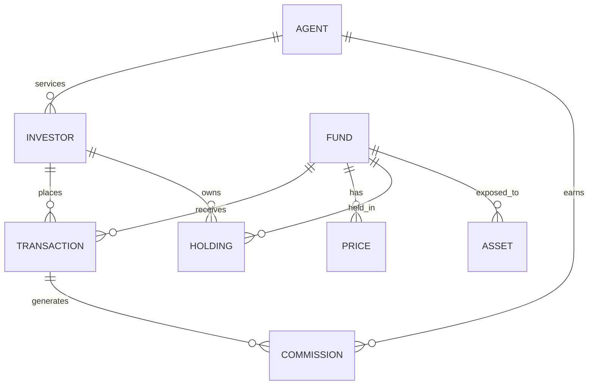

# Data Model

## Source Entity Relationship

## Source Tables

### Investor

- `investor_id`
- `agent_id`
- `investor_type`
- `first_name`
- `last_name`
- `country_code`
- `kyc_status`
- `risk_rating`
- `created_at`
- `updated_at`

### Agent

- `agent_id`
- `agent_code`
- `agent_name`
- `channel`
- `country_code`
- `active_flag`
- `created_at`
- `updated_at`

### Fund

- `fund_id`
- `fund_code`
- `fund_name`
- `asset_class`
- `currency_code`
- `fund_status`
- `launch_date`
- `created_at`
- `updated_at`

### Transaction

- `transaction_id`
- `investor_id`
- `agent_id`
- `fund_id`
- `transaction_type`
- `transaction_status`
- `trade_date`
- `settlement_date`
- `units`
- `price`
- `gross_amount`
- `fee_amount`
- `net_amount`
- `currency_code`
- `created_at`
- `updated_at`

### Price

- `price_id`
- `fund_id`
- `valuation_date`
- `nav_price`
- `currency_code`
- `price_source`
- `created_at`

### Holding

- `holding_id`
- `investor_id`
- `fund_id`
- `valuation_date`
- `units`
- `nav_price`
- `market_value`
- `currency_code`
- `created_at`

### Commission

- `commission_id`
- `transaction_id`
- `agent_id`
- `fund_id`
- `commission_date`
- `commission_type`
- `commission_rate`
- `commission_amount`
- `currency_code`
- `created_at`

### Asset

- `asset_id`
- `fund_id`
- `asset_code`
- `asset_name`
- `asset_type`
- `sector`
- `country_code`
- `market_value`
- `valuation_date`

## Dimensional Model

### Grain

- `fact_transaction` - one row per source transaction.
- `fact_agent_commission_daily` - one row per agent, fund, commission type, day.
- `fact_investor_holding_daily` - one row per investor, fund, valuation day.
- `fact_fund_flow_daily` - one row per fund, transaction type, day.
- `fact_fund_flow_monthly` - one row per fund, transaction type, month.
- `fact_fund_aum_daily` - one row per fund and valuation day.

### Core Measures

- `transaction_count`
- `gross_amount`
- `net_amount`
- `subscription_amount`
- `redemption_amount`
- `commission_amount`
- `holding_units`
- `market_value`
- `aum_amount`
- `nav_price`

### Conformed Dimensions

- Date is shared across trade date, settlement date, valuation date, and commission date.
- Fund is shared across transaction, holding, commission, and price facts.
- Agent is shared across investor servicing and commission facts.
- Investor is shared across transaction and holding facts.

## Reconciliation Rules

- Daily fund flow net amount equals subscriptions minus redemptions plus adjustments.
- Holding market value equals holding units multiplied by NAV price.
- Agent daily commission equals commissionable amount multiplied by commission rate.
- Monthly commission equals sum of daily commission for the month.
- Fund AUM equals sum of investor market value by fund and valuation date.

