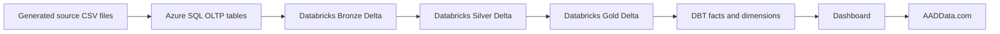

# Pipeline And Azure Setup

## Correct Data Flow

The source data files are for the Azure SQL operational database, not for the data warehouse.

Recommended flow:



## Why This Pipeline

This design is stronger for your CV because it mirrors an enterprise source-to-lakehouse platform:

- Azure SQL behaves like the operational transfer agency source.
- Databricks demonstrates lakehouse ingestion, Delta Lake, data quality, and transformation.
- DBT demonstrates analytics engineering discipline over curated data.
- Dashboard reads from facts and dimensions, not from raw source tables.

## Local-To-Cloud Steps

### 1. Generate source files

Run:

```powershell
python scripts\generate_sample_data.py
```

This creates:

- `sample_data/source/*.csv` for Azure SQL source loading.
- `sample_data/marts/*.csv` only for local dashboard demo mode.

### 2. Create Azure SQL tables

Run this script in Azure Data Studio or SQL Server Management Studio:

```text
sql/azure_sql_schema.sql
```

### 3. Load source CSV files into Azure SQL

Use:

```powershell
pip install pyodbc
$env:AZURE_SQL_CONNECTION_STRING="Server=tcp:<server>.database.windows.net,1433;Database:<db>;Uid:<user>;Pwd:<password>;Encrypt=yes;TrustServerCertificate=no;Connection Timeout=30;"
python scripts\load_source_csvs_to_azure_sql.py
```

If `pyodbc` complains, install the Microsoft ODBC Driver for SQL Server.

### 4. Import Databricks notebooks

Import these files into a Databricks workspace folder such as `/Workspace/MutualFund`:

- `databricks/00_config.py`
- `databricks/01_setup_catalog_schemas.py`
- `databricks/02_ingest_azure_sql_to_bronze.py`
- `databricks/03_bronze_to_silver.py`
- `databricks/04_silver_to_gold.py`
- `databricks/05_delta_maintenance_and_quality.py`

Update `00_config.py` with:

- Azure SQL server host.
- Azure SQL database.
- ADLS Gen2 storage path.
- Databricks secret scope name.

### 5. Run Databricks pipeline

Run notebooks in this order:

1. `01_setup_catalog_schemas`
2. `02_ingest_azure_sql_to_bronze`
3. `03_bronze_to_silver`
4. `04_silver_to_gold`
5. `05_delta_maintenance_and_quality`

Later, create a Databricks Workflow using `databricks/databricks_job.json` as the design template.

### 6. Run DBT

Point DBT to Databricks or Snowflake, then run:

```powershell
dbt debug
dbt run
dbt test
dbt docs generate
```

## Azure Services To Create This Week

Create one dedicated resource group, for example:

```text
rg-aad-mutual-fund-dev
```

Minimum services:

- Azure SQL Database for OLTP source.
- Azure Storage Account with ADLS Gen2 enabled for Delta Lake storage.
- Azure Databricks workspace.
- Azure Key Vault for secrets.
- Azure Static Web Apps for AADData.com.

Optional later:

- Azure Data Factory if you want to demonstrate orchestration outside Databricks.
- Azure App Service or Azure Container Apps for the dashboard.
- Microsoft Entra ID app registration if you want dashboard authentication.

## Recommended Development Pipeline

For this project, start with Databricks Workflows, not Azure Data Factory.

Reason:

- You are studying for Databricks Data Engineer Associate.
- Databricks Workflows keeps ingestion, Delta Lake processing, quality checks, and maintenance in one place.
- It is simpler and cheaper for a portfolio project.

Add Azure Data Factory later as an orchestration extension:

- Trigger Databricks jobs.
- Copy files into landing storage.
- Demonstrate Azure-native orchestration knowledge.

## Cost-Control Settings

Use a dev-only setup:

- Single small Azure SQL Database or serverless Azure SQL where available.
- Small Databricks job cluster.
- Auto-termination set to 10-20 minutes.
- Avoid always-on SQL warehouses while learning.
- Use ADLS lifecycle rules only after the basic project works.
- Add a budget alert in Azure Cost Management on day one.

## Suggested First Cloud Milestone

The first success milestone should be small:

1. Create Azure SQL.
2. Load the generated source CSV files.
3. Create Databricks workspace and secret scope.
4. Run Bronze ingestion from Azure SQL.
5. Confirm Bronze Delta tables exist.

After that, build Silver, Gold, DBT, and dashboard.

